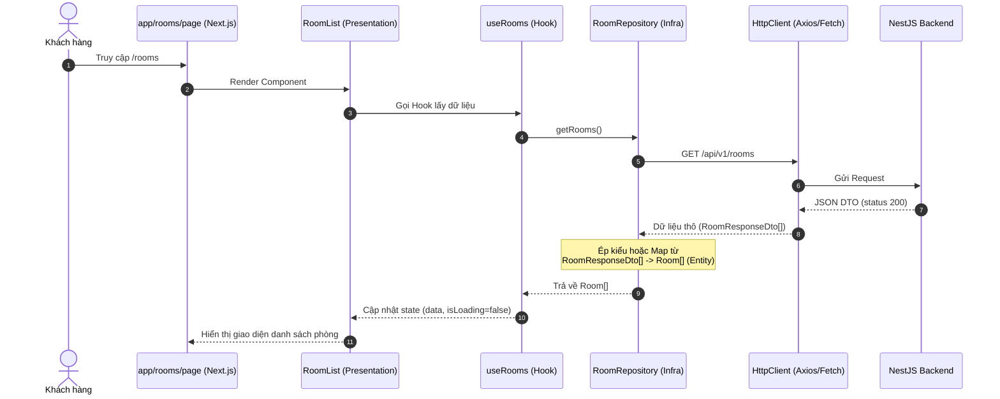

# Tài Liệu Phân Tích Cấu Trúc Thư Mục Hybrid Clean Architecture (Next.js App Router)

##### Tài liệu này đề xuất cấu trúc thư mục áp dụng sự kết hợp giữa Clean Architecture và Feature-Sliced Design (FSD) cho dự án frontend dành cho khách hàng KTV (`ktv_cus`), sử dụng Next.js (App Router), React, và Tailwind CSS.

---

## 1. Tổng Quan Về Kiến Trúc Hybrid Trong Frontend

```
                 ┌──────────────────────────────────────┐
                 │       Presentation Layer (UI/State)  │
                 │   ┌──────────────────────────────┐   │
                 │   │     Data Layer (Infra)       │   │
                 │   │   ┌──────────────────────┐   │   │
                 │   │   │     Domain Layer     │   │   │
                 │   │   │  (Entities/UseCases) │   │   │
                 │   │   └──────────────────────┘   │   │
                 │   └──────────────────────────────┘   │
                 └──────────────────────────────────────┘
                  Dependencies point inwards (Presentation -> Data -> Domain)
```

### Tại sao nên áp dụng cho dự án KTV_FE_CUS?

1. **Tránh Over-engineering**: Hệ thống K-Master đã có một Backend NestJS cực kỳ mạnh mẽ để xử lý các luồng phức tạp (tính tiền, check giờ vàng, logic kho). Frontend chủ yếu mang tính chất "Data-driven UI" (hiển thị dữ liệu trả về). Việc ép buộc viết toàn bộ UseCases hay Mappers ở Frontend là dư thừa.
2. **Cô lập tính năng (High Cohesion)**: Toàn bộ UI, Hooks, và State của một tính năng (VD: booking) được đặt chung một chỗ. Khi bạn muốn sửa hoặc xóa tính năng đặt phòng, bạn chỉ cần thao tác trong một thư mục duy nhất.
3. **Đồng bộ với NestJS**: Tầng Hạ tầng (infrastructure) với các DTOs được thiết kế để phản chiếu (mirror) chính xác cấu trúc DTOs mà Backend NestJS trả về.
4. **App Router Sạch (Clean Routing)**: Thư mục `app/` của Next.js chỉ làm nhiệm vụ đúng nghĩa của nó: Cấu hình Route, Layout, Metadata SEO và nhúng Component vào.

---

## 2. Chi Tiết Bản Đề Xuất Cấu Trúc Thư Mục (Folder Plan)

Cấu trúc thư mục được đề xuất đặt toàn bộ mã nguồn Clean Architecture trong thư mục `src/`, giữ cho thư mục `app/` của Next.js mỏng và chỉ làm nhiệm vụ Routing/Server rendering.

```text
ktv_cus/
├── app/                                    # 1. TẦNG ỨNG DỤNG (Next.js Routing)
│   ├── layout.tsx                          # Layout gốc (Root providers, globals.css)
│   ├── page.tsx                            # Trang chủ
│   ├── rooms/                              # Route: /rooms
│   │   └── page.tsx                        # Server Component, gọi Component từ tầng Presentation
│   └── booking/                            # Route: /booking
│       └── page.tsx
│
├── src/                                    # THƯ MỤC NGUỒN CHÍNH
│   ├── core/                               # 2. TẦNG LÕI (Domain Layer - Types & Interfaces)
│   │   ├── entities/                       # Định nghĩa thực thể thuần túy (Không dính React)
│   │   │   ├── room.entity.ts
│   │   │   └── booking.entity.ts
│   │   └── exceptions/                     # Định nghĩa lỗi (Custom Errors)
│   │
│   ├── infrastructure/                     # 3. TẦNG HẠ TẦNG (Data Layer - Giao tiếp API)
│   │   ├── api/                            # Cấu hình gọi mạng
│   │   │   └── http-client.ts              # Cấu hình Axios/Fetch chung, Interceptors (gắn Token)
│   │   ├── dtos/                           # Kiểu dữ liệu khớp 100% với NestJS Backend
│   │   │   ├── room.dto.ts
│   │   │   └── auth.dto.ts
│   │   └── repositories/                   # Thực thi gọi API
│   │       ├── room.repository.ts
│   │       └── auth.repository.ts
│   │
│   ├── presentation/                       # 4. TẦNG TRÌNH DIỄN (UI & Logic Giao Diện)
│   │   ├── features/                       # CHIA THEO TÍNH NĂNG (Trái tim của kiến trúc)
│   │   │   ├── room/                       # Tính năng: Danh sách phòng
│   │   │   │   ├── components/             # Components riêng của phòng (VD: RoomCard, RoomFilter)
│   │   │   │   └── hooks/                  # Logic React Query/SWR gọi Repository (VD: useRooms)
│   │   │   └── booking/                    # Tính năng: Đặt phòng
│   │   │       ├── components/             # (VD: BookingForm, TimeSlotPicker)
│   │   │       ├── hooks/                  # (VD: useCreateBooking)
│   │   │       └── store/                  # Trạng thái giữ chỗ tạm thời (Zustand)
│   │   │
│   │   ├── shared_ui/                      # UI Components dùng chung (Atomic Design / Shadcn UI)
│   │   │   ├── button.tsx
│   │   │   └── modal.tsx
│   │   └── layouts/                        # Các block layout lớn (Header, Footer, Sidebar)
│   │
│   └── shared/                             # 5. TẦNG CHIA SẺ (Cross-cutting Concerns)
│       ├── constants/                      # Hằng số (Enum, Regex, API Endpoints)
│       ├── utils/                          # Hàm hỗ trợ (formatCurrency, formatDate)
│       └── lib/                            # Khởi tạo thư viện (tailwind-merge, dayjs)
│
├── tailwind.config.js
└── package.json
```

---

## 3. Phân Tích Chức Năng Từng Lớp

### 3.1. Lớp Tầng Lõi (`src/core/`)

Định nghĩa khuôn mẫu cốt lõi của ứng dụng. Do logic nghiệp vụ đã nằm ở NestJS, lớp này chủ yếu chứa các Entities (Khai báo Type/Interface TypeScript). Frontend sẽ dựa vào đây để biết một đối tượng Phòng hát hoặc Hóa đơn trông như thế nào.

### 3.2. Lớp Hạ Tầng (`src/infrastructure/`)

Nơi duy nhất trong ứng dụng thực hiện các tác vụ giao tiếp ra môi trường bên ngoài (Network).

- **DTOs**: Sao chép y hệt cấu trúc trả về từ Swagger của NestJS.
- **Repositories (Implementations)**: Đóng gói các lời gọi API. Giao diện (Presentation) không bao giờ được gọi thẳng Axios/Fetch, mà phải gọi qua Repository.

### 3.3. Lớp Trình Diễn (`src/presentation/`)

Chứa toàn bộ mã React. Đây là nơi tận dụng tư tưởng FSD (Feature-Sliced Design):

- **Features**: Thay vì nhóm toàn bộ component vào một chỗ, toàn bộ hook vào một chỗ, chúng ta gom chúng theo Nghiệp Vụ. Ví dụ: Thư mục room sẽ chứa mọi thứ để hiển thị và thao tác với phòng hát.
- **Hooks**: Đóng vai trò là Controller. Hook sẽ gọi Repository để lấy dữ liệu, xử lý loading/error, và cung cấp state sạch sẽ cho Component hiển thị. Khuyên dùng React Query ở tầng này.

---

## 4. Luồng Dữ Liệu Thực Tế (Data Flow)

Luồng dữ liệu được đơn giản hóa để phù hợp với môi trường React/Next.js tốc độ cao:



---

## 5. Ví Dụ Code Minh Họa Cho Tính Năng Hiển Thị Phòng

Sự mạch lạc thể hiện rõ qua cách các file giao tiếp với nhau:

### Lớp Domain (Business Core)

#### 1. Entity (`src/core/entities/room.entity.ts`)

```typescript
export interface Room {
  id: string;
  roomNumber: string;
  type: "VIP" | "STANDARD";
  pricePerHour: number;
  status: "AVAILABLE" | "IN_USE" | "MAINTENANCE";
}
```

#### 2. DTO & Repository (`src/infrastructure/repositories/room.repository.ts`)

```typescript
import { apiClient } from "../api/http-client";
import { Room } from "@/core/entities/room.entity";

// DTO khớp với API trả về từ NestJS
export interface RoomResponseDto {
  id: string;
  room_number: string;
  room_type: "VIP" | "STANDARD";
  base_price_per_hour: number;
  status: "AVAILABLE" | "IN_USE" | "MAINTENANCE";
}

export const RoomRepository = {
  getRooms: async (): Promise<Room[]> => {
    const { data } = await apiClient.get<RoomResponseDto[]>("/v1/rooms");

    // Mapping nhẹ nhàng tại chỗ (từ snake_case sang camelCase của Entity)
    return data.map((dto) => ({
      id: dto.id,
      roomNumber: dto.room_number,
      type: dto.room_type,
      pricePerHour: dto.base_price_per_hour,
      status: dto.status,
    }));
  },
};
```

#### 3. Custom Hook (`src/presentation/features/room/hooks/use-rooms.ts`)

```typescript
import { useState, useEffect } from "react";
import { Room } from "@/core/entities/room.entity";
import { RoomRepository } from "@/infrastructure/repositories/room.repository";

export const useRooms = () => {
  const [rooms, setRooms] = useState<Room[]>([]);
  const [isLoading, setIsLoading] = useState(true);
  const [error, setError] = useState<string | null>(null);

  // Ghi chú: Thực tế nên dùng @tanstack/react-query thay vì tự viết useEffect
  useEffect(() => {
    let isMounted = true;
    RoomRepository.getRooms()
      .then((data) => {
        if (isMounted) setRooms(data);
      })
      .catch((err) => {
        if (isMounted) setError(err.message || "Lỗi khi tải dữ liệu");
      })
      .finally(() => {
        if (isMounted) setIsLoading(false);
      });

    return () => {
      isMounted = false;
    };
  }, []);

  return { rooms, isLoading, error };
};
```

#### 4. Feature Component (`src/presentation/features/room/components/room-list.tsx`)

```tsx
"use client";

import React from "react";
import { useRooms } from "../hooks/use-rooms";

export const RoomList: React.FC = () => {
  const { rooms, isLoading, error } = useRooms();

  if (isLoading) {
    return (
      <div className="text-zinc-500 text-center py-4">
        Đang tải sơ đồ phòng...
      </div>
    );
  }

  if (error) {
    return <div className="text-red-500 text-center py-4">{error}</div>;
  }

  return (
    <div className="grid grid-cols-1 sm:grid-cols-2 md:grid-cols-4 gap-4">
      {rooms.map((room) => (
        <div
          key={room.id}
          className="p-4 border border-zinc-200 rounded-lg shadow-sm bg-white dark:bg-zinc-900 dark:border-zinc-800"
        >
          <h3 className="font-bold text-zinc-900 dark:text-zinc-50">
            Phòng {room.roomNumber}
          </h3>
          <p className="text-zinc-600 dark:text-zinc-400 text-sm">
            Loại: {room.type}
          </p>
          <p className="text-zinc-600 dark:text-zinc-400 text-sm">
            Giá: {room.pricePerHour.toLocaleString()}đ/h
          </p>
          <span
            className={`inline-block mt-2 text-xs font-semibold px-2.5 py-0.5 rounded-full ${
              room.status === "AVAILABLE"
                ? "bg-green-100 text-green-800 dark:bg-green-900/30 dark:text-green-400"
                : room.status === "IN_USE"
                  ? "bg-red-100 text-red-800 dark:bg-red-900/30 dark:text-red-400"
                  : "bg-yellow-100 text-yellow-800 dark:bg-yellow-900/30 dark:text-yellow-400"
            }`}
          >
            {room.status}
          </span>
        </div>
      ))}
    </div>
  );
};
```

#### 5. Next.js App Router (`app/rooms/page.tsx`)

```tsx
import { RoomList } from "@/presentation/features/room/components/room-list";

// Page của Next.js cực kỳ sạch sẽ, chỉ đóng vai trò entrypoint/routing container và SEO/Metadata
export default function RoomsPage() {
  return (
    <main className="container mx-auto p-8">
      <h1 className="text-3xl font-bold mb-8 text-zinc-900 dark:text-white">
        Danh sách phòng Karaoke
      </h1>
      <RoomList />
    </main>
  );
}
```

---

## 6. Đánh Giá Khách Quan (Pros & Cons)

| Ưu Điểm (Pros)                                                                                                                                                                       | Nhược Điểm (Cons)                                                                                                                                                                      |
| :----------------------------------------------------------------------------------------------------------------------------------------------------------------------------------- | :------------------------------------------------------------------------------------------------------------------------------------------------------------------------------------- |
| **Tính Cô Lập Cực Cao (Cohesion)**: Sửa đổi hoặc xóa một tính năng chỉ gói gọn trong một thư mục `features/xyz/`. Không để lại "rác" trong hệ thống.                                 | **Nguy cơ vi phạm ranh giới**: Cần có kỷ luật (hoặc cấu hình ESLint) để ngăn chặn tính năng `room` import trực tiếp một component từ tính năng `booking` (nên giao tiếp qua `shared`). |
| **Bypass Boilerplate**: Lược bỏ được các file UseCase và Mapper rườm rà nếu dữ liệu từ Backend trả về đã chuẩn xác. Code ngắn gọn, tốc độ ra tính năng (Feature Delivery) cực nhanh. | **Không hoàn toàn thuần khiết (Purist)**: Những người theo trường phái Clean Architecture nguyên thủy có thể thấy việc bỏ qua tầng UseCase là vi phạm nguyên tắc.                      |
| **App Router Sạch Sẽ**: Tránh được tình trạng file `page.tsx` dài hàng ngàn dòng chứa đủ cả giao diện, gọi API lẫn logic.                                                            |                                                                                                                                                                                        |
| **Đồng bộ tư duy tốt**: Kết hợp hoàn hảo với tư duy Module của NestJS Backend (NestJS có `RoomsModule`, Next.js có `features/room`).                                                 |                                                                                                                                                                                        |

---

## 7. Đề Xuất Các Bước Triển Khai Cho Dự Án KTV_FE_CUS

1. **Giai đoạn 1: Chuẩn hóa Hạ tầng (Infrastructure)**
   Cấu hình ngay `http-client.ts` (xử lý gắn Bearer Token tự động vào Header, bắt lỗi 401 Unauthorized để refresh token hoặc logout).

2. **Giai đoạn 2: Định hình core và dtos**
   Yêu cầu Frontend copy/dịch các interfaces từ Swagger/NestJS DTOs sang thư mục `infrastructure/dtos/` để đảm bảo 2 bên hiểu cùng một ngôn ngữ.

3. **Giai đoạn 3: Bắt tay vào Code Tính Năng**
   Tạo thư mục `presentation/features/auth` trước để xử lý luồng Đăng nhập/Đăng ký. Cài đặt Zustand tại `features/auth/store/auth.store.ts` để quản lý Token.

4. **Giai đoạn 4: Quản lý State Server**
   Tích hợp mạnh mẽ thư viện React Query vào các Hooks để tự động hóa việc caching, retry khi lỗi và refetch dữ liệu mà không cần viết `useEffect`.
